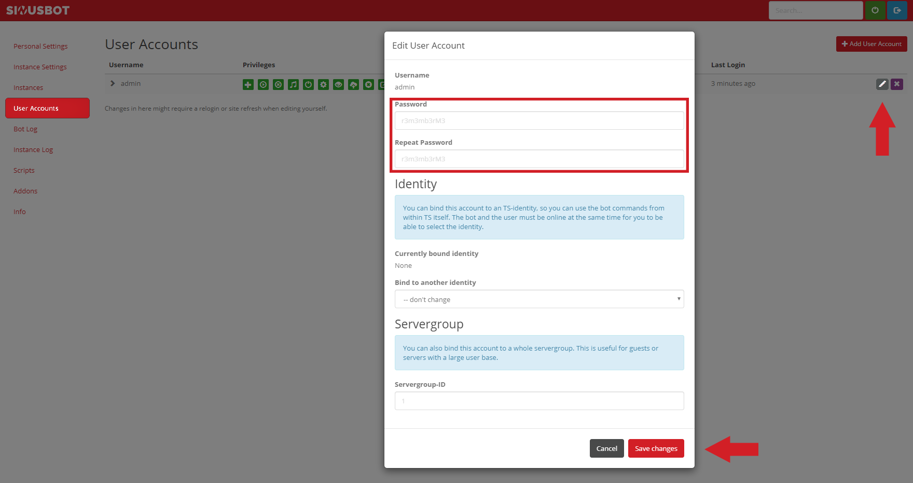
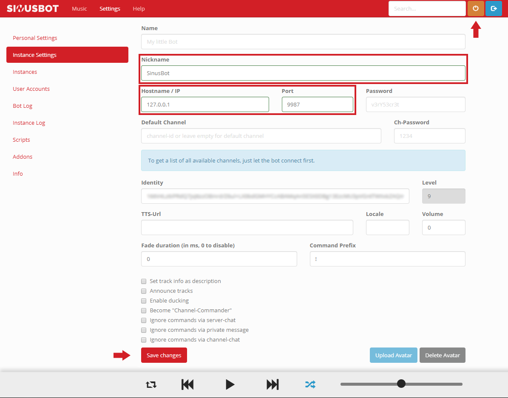
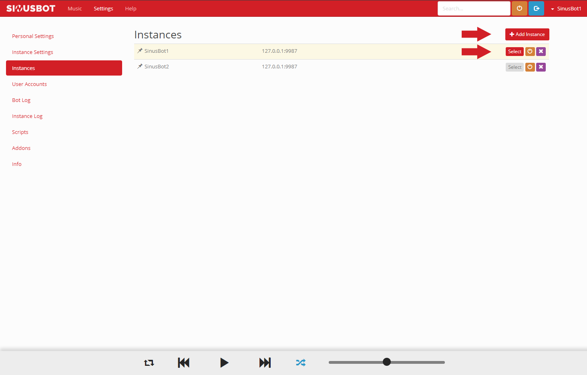

## Introduction

This article describes the installation and configuration of a SinusBot program with two instances, you can use one SinusBot per instance. It is also possible to run multiple SinusBot programs in parallel to use several SinusBots.

#### But what is SinusBot actually?

SinusBot is a program that allows you to listen to your favorite music together with your friends on Teamspeak.

**Requirements**

+ A 64-bit compatible OS
+ Ubuntu 14.04+/ Debian 8+
+ A CX11 Hetzner CloudServer or better
+ Teamspeak

## Step 1 - Preparations

Before we get started your CloudServer should be updated.
```bash
apt-get update && apt-get -y upgrade
```
SinusBot needs several dependencies which have to be installed urgently!
```bash
apt-get install -y x11vnc xvfb libxcursor1 ca-certificates bzip2 libnss3 libegl1-mesa x11-xkb-utils libasound2 libglib2.0-0 libgl1 libnspr4 libfontconfig1 libxi6 libxcursor1 libxcomposite1 libasound2 libxtst6
```
Update the certificates by `ca-certificates`.
```bash
update-ca-certificates
```
For the installation a user `sinusbot` must be created.
```bash
useradd -m -s /bin/false sinusbot
```
Now the installation directory must be created.
```bash
mkdir /opt/sinusbot && chown -R sinusbot:sinusbot /opt/sinusbot
```

## Step 2 - Installation

For the installation we have to switch to the created `sinusbot` user.
```bash
su --shell /bin/bash sinusbot
```
Change to the `sinusbot` installation directory.
```bash
cd /opt/sinusbot
```
Now we need the newest SinusBot version which we unpack directly.
```bash
curl https://www.sinusbot.com/dl/sinusbot.current.tar.bz2 | tar xjf -
```
To make SinusBot work, a Teamspeak client must be installed in the installation directory and the permissions have to be adjusted.
```bash
wget http://dl.4players.de/ts/releases/3.2.3/TeamSpeak3-Client-linux_amd64-3.2.3.run && chmod 0755 TeamSpeak3-Client-linux_amd64-3.2.3.run
```
Now the Teamspeak Client has to be unpacked.
```bash
./TeamSpeak3-Client-linux_amd64-3.2.3.run
```
+ #### In the unpacking process press `Enter` + `q` + `y` + `Enter` in succession!

## Step 3 - Configuration

After the Teamspeak was unpacked. Now the `config.ini.dist` must be copied and edited.
```bash
cp config.ini.dist config.ini && nano config.ini
```
In the `config.ini` the following must be replaced: 
#### `TS3Path = "/opt/ts3soundboard/TeamSpeak3-Client-linux_amd64/ts3client_linux_amd64"`
Replace with:
#### `TS3Path = "/opt/sinusbot/TeamSpeak3-Client-linux_amd64/ts3client_linux_amd64"`
+ #### To save `Ctrl+O` + `Enter` and to exit press `Ctrl+X`!
In the Teamspeak installation directory I recommend to delete an unneeded library, otherwise you might have problems with Teamspeak.
```bash
rm TeamSpeak3-Client-linux_amd64/xcbglintegrations/libqxcb-glx-integration.so
```
Now the folder structure in the Teamspeak installation directory has to be adapted and an important plugin has to be copied.
```bash
mkdir TeamSpeak3-Client-linux_amd64/plugins && cp plugin/libsoundbot_plugin.so TeamSpeak3-Client-linux_amd64/plugins/ && chmod 755 sinusbot
```
Now SinusBot has to be started for the first time.
```bash
./sinusbot
```
In the CLI SinusBot generates access data which you can use to access the SinusBot webinterface under: yourserverip:8087


After logging in, the webinterface appears.


I recommend to change the password generated by SinusBot with your own secure password directly at the beginning!

Settings > User Account > Edit (pen)

Press `Save changes` to change your password.



If you have changed your password we can connect your SinusBot to a Teamspeak server.

Settings > Instance Settings

+ Nickname: Display name in Teamspeak
+ Hostname/IP: Address of the Teamspeak server
+ Port: By default to 9987

Press `Save changes` to save your settings.

After saving, the SinusBot can be switched on by pressing the orange button (next to the search).



In the SinusBot webinterface a second instance can be added.

Settings > Instances > Add Instance

With `select` one of the instances can be selected and configured under Settings > Instance Settings.

>***Notice:*** If two SinusBot instances are not enough you have the possibility to run several SinusBot programs in parallel, just follow the steps above for each installation.
>```bash
>mkdir /opt/sinusbot1 && chown -R sinusbot:sinusbot /opt/sinusbot1
>mkdir /opt/sinusbot2 && chown -R sinusbot:sinusbot /opt/sinusbot2
>mkdir /opt/sinusbot3 && chown -R sinusbot:sinusbot /opt/sinusbot3
>
>etc...
>```


To start SinusBot easily a `startscript` can be used. This must be done as `root` user! So just use the `exit` command to leave the `sinusbot` user.
```bash
curl -o /lib/systemd/system/sinusbot.service https://raw.githubusercontent.com/SinusBot/linux-startscript/master/sinusbot.service && nano /lib/systemd/system/sinusbot.service
```
Now you have to change some entries in the `sinusbot.service`.
```bash
User=sinusbot                      #Created user
ExecStart=/opt/sinusbot/sinusbot   #Path to the SinusBot binary
WorkingDirectory=/opt/sinusbot     #Path to the SinusBot directory
```
+ #### To save `Ctrl+O` + `Enter` and to exit press `Ctrl+X`!
To apply the changes to the `sinusbot.service`, `systemctl` must be reloaded.
```bash
systemctl daemon-reload
```
(Optional) SinusBot can also be started automatically after a restart.
```bash
systemctl enable sinusbot
```
Our SinusBot can now be started by using `systemctl`.
```bash
systemctl start sinusbot
```

> ***Notice:*** If you have multiple SinusBot installations and want to use the `startscript`, consider creating multiple startscripts and changing the path for each installation.
>```bash
>/lib/systemd/system/sinusbot1.service https://...
>/lib/systemd/system/sinusbot2.service https://...
>/lib/systemd/system/sinusbot3.service https://...
>```
>```bash
>sinusbot1.service
>
>User=sinusbot                       #Created user
>ExecStart=/opt/sinusbot1/sinusbot   #Path to the SinusBot binary
>WorkingDirectory=/opt/sinusbot1     #Path to the SinusBot directory
>
>```
>```bash
>sinusbot2.service
>
>User=sinusbot                       #Created user
>ExecStart=/opt/sinusbot2/sinusbot   #Path to the SinusBot binary
>WorkingDirectory=/opt/sinusbot2     #Path to the SinusBot directory
>
>etc...
>```
>

## Conclusion

If you have followed the tutorial so far, you now have your own SinusBot program with two instances and can use up to two SinusBots on two different Teamspeak servers. Optionally you can let SinusBot start automatically after each restart.

##### License: MIT

<!---

Contributors's Certificate of Origin

By making a contribution to this project, I certify that:

(a) The contribution was created in whole or in part by me and I have
    the right to submit it under the license indicated in the file; or

(b) The contribution is based upon previous work that, to the best of my
    knowledge, is covered under an appropriate license and I have the
    right under that license to submit that work with modifications,
    whether created in whole or in part by me, under the same license
    (unless I am permitted to submit under a different license), as
    indicated in the file; or

(c) The contribution was provided directly to me by some other person
    who certified (a), (b) or (c) and I have not modified it.

(d) I understand and agree that this project and the contribution are
    public and that a record of the contribution (including all personal
    information I submit with it, including my sign-off) is maintained
    indefinitely and may be redistributed consistent with this project
    or the license(s) involved.

Signed-off-by: c.akoutas@live.de

-->
